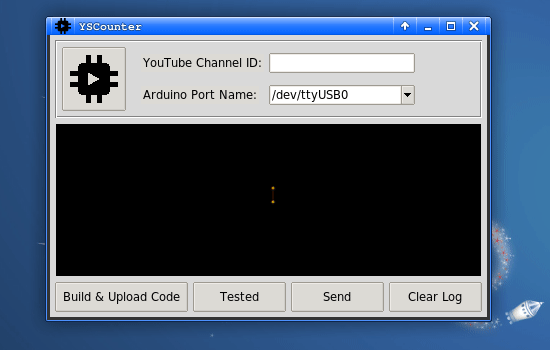
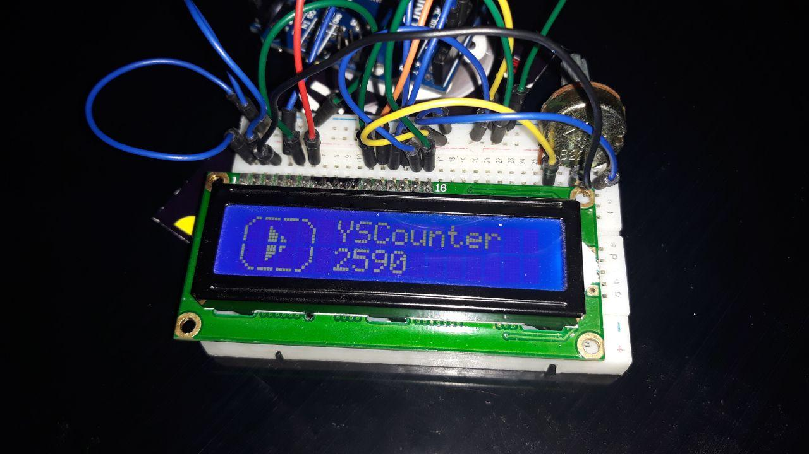

# YSCounter


**Y**ouTube **S**ubscriber **Counter** with Arduino and Python (Without API key). Scrape Live subscriber Counter data from the [Social Blade](https://socialblade.com) website and display it on a 2X16 LCD screen using Arduino. You don't need the *YouTube API key* to do this.


Visit my friend's YouTube channel! <br/>
**Nepercos**: [youtube.com/nepercos](https://youtube.com/nepercos)

### Availability
Only GNU/Linux

## Requirements

[Click](diagrams/) for circuit diagrams...

Piece | Component
--- | ---
1x | Arduino (Preferably the *Uno* model)
1x | Serial port cable
1x | 2x16 LCD screen
1x | 10K resistor or 10K potentiometer
18x | Jumper cable
1x | Breadboard to test

## Installing
```sh
git clone https://github.com/adlgrbz/yscounter
```

Install via Python:
```sh
cd yscounter
python3 setup.py build && [sudo] python3 setup.py install
```

## Usage
1. Open the software <br/>
`$ yscounter` or `Application Menu` > `Utility` > `YSCounter`
2. Enter your YouTube channel ID <br/>
How to find the [channel ID](https://support.google.com/youtube/answer/3250431?hl=en)?
3. Choose the Arduino port
4. Upload the code to the Arduino card
5. Test the subscriber data
6. Send the data to the Arduino card

## Demo





## Contributors

<table><tr><td align="center"><a href="https://github.com/GizliProfesor"><br/><sub>GizliProfesor</b></sub></a><br/></td></tr></table>

## License
This project is licensed under the GNU GPL v3 License - see the [LICENSE](LICENSE) file for details